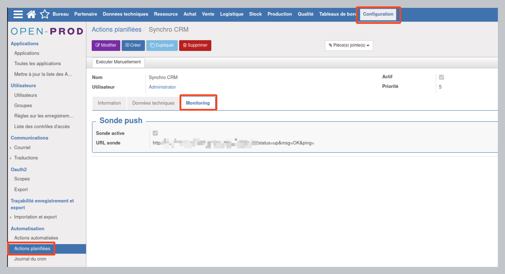
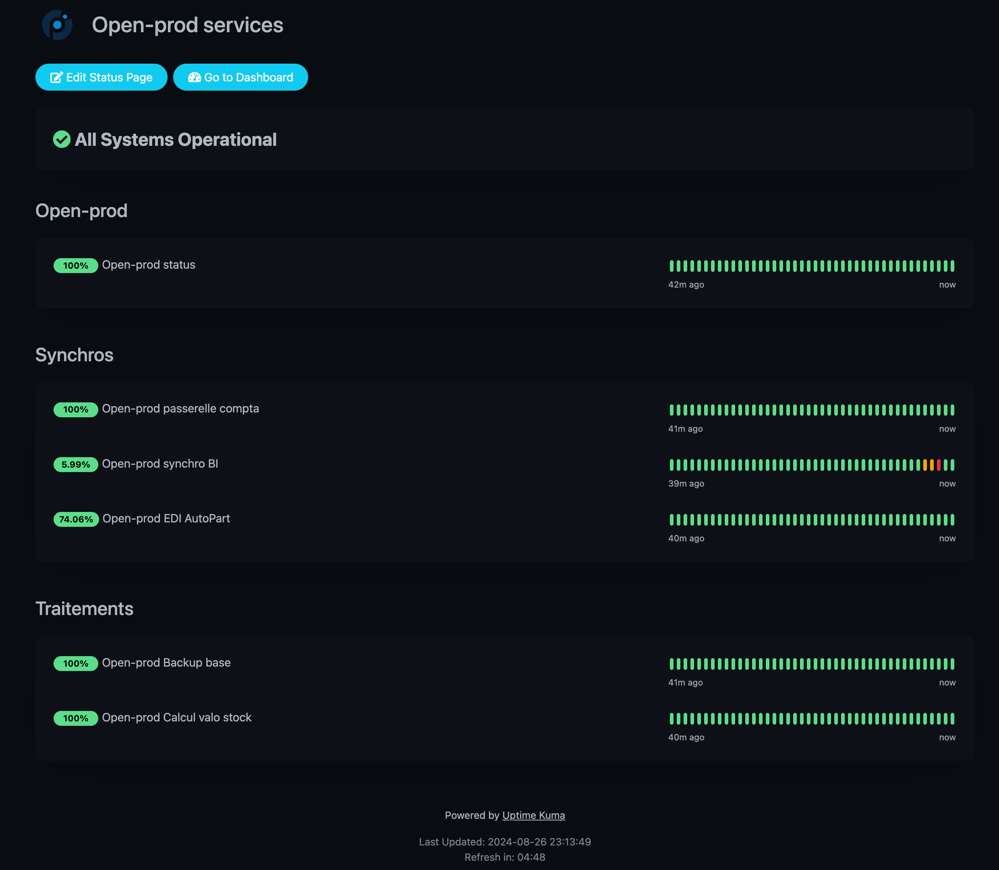

# Module Open-prod : Cron monitoring (Uptime Kuma)

[](https://www.gnu.org/licenses/lgpl-3.0) [](https://github.com/votre-utilisateur/module-gestion-flotte) 


## Vue d'ensemble

 Ce module est conçu pour monitorer vos CRON (tâches planifiées) sur [l'ERP Open-prod](https://open-prod.com/) Synchronisations, EDI, backups,... Toutes vos tâches critiques sont désormais monitorées.
 Vous pouvez mesurer le taux de disponibilité (Uptime), et être alerté via Uptimke Kuma (Mail, SMS, ...)


## Fonctionnalités

- **Sonde push** : Sur vos tâches critiques, associez une sonde Uptime Kuma. Dès lors que la tâche sera terminée sans erreurs, la sonde sera 'Up' sur Uptime Kuma. En revanhce si la tâche n'est pas déclenchée dans le délai imparti ou s'il y un échec lors de l'exécution, la sonde Uptime Kuma sera 'down', et vous serez averti.


## Dépendances

Aucune dépendance spécifique requise.
Le logiciel open-souce Uptime Kuma est requis pour gérer les états des sondes.

## Installation

1. **Téléchargez le Module** : Clonez le dépôt ou téléchargez le fichier ZIP.
    ```bash
    git clone https://github.com/App4indus/cron_monitoring.git
    ```

2. **Ajoutez à Open-prod** : Copiez le module dans votre répertoire d'addons custom d'Open-prod.
    ```bash
    cp -r cron_monitoring /chemin/vers/openprod/custom-addons/
    ```

3. **Configuration ficher openpord-server.conf** : Ajoutez le dossier custom-addons au ficher openprod-server.conf
   Vérifiez que le path vers 'custom-addons' est dans le fichier openprod-server.conf, champ "addons_path ="

4. **Mettez à jour la Liste des Applications** : Dans Open-prod, mettez à jour la liste des applications pour inclure le nouveau module : Configuration > Applications > Mettre à jour la liste des applications


5. **Installer le Module** : Dans Open-prod, installez le module : Configuration > Applications > Toutes les applications > rechercher 'Cron monitoring' > Installer.

## Utilisation

Consultez la notice d'utilisation qui contient toute la documentation nécessaire à l'utilisation du module : 

> [Notice d'utilisation](docs/user_manual_fr.md)

## Screens 






## Contribution

Les pull requests sont les bienvenues - Si vous souhaitez contribuer au développement de ce module, suivez ces étapes :

1. Forkez le dépôt.
2. Créez une nouvelle branche (`git checkout -b feature/votre-fonctionnalité`).
3. Commitez vos modifications (`git commit -am 'Ajout d'une nouvelle fonctionnalité'`).
4. Poussez sur la branche (`git push origin feature/votre-fonctionnalité`).
5. Ouvrez une pull request.

## Licence

Ce projet est licencié sous la licence LGPL-3.0 - voir le fichier [LICENSE](LICENSE) pour plus de détails.

## Tarif

Ce projet open-source est gratuit et libre d'utilisation.

## Instance Uptime Kuma

Vous souhaitez utiliser le module mais vous n'avez pas d'instance Uptime Kuma ? 
App4indus peut vous forunir une instance clé en main, sondes illimitées, configuration comprise. Pour plus d'infos : [info@app4indus.com](mailto:info@app4indus.com)

## Absence de Garantie

Ce logiciel est distribué en l'état, sans aucune garantie. En aucun cas, les auteurs ou les titulaires du droit d'auteur ne peuvent être tenus responsables de toute réclamation, de tout dommage ou de toute autre responsabilité, qu'il s'agisse d'une action contractuelle, délictuelle ou autre, découlant de, hors de ou en relation avec le logiciel ou l'utilisation ou d'autres actions dans le logiciel.

## Contact

Pour toute questions, suggestions, customisation ou support, veuillez contacter [info@app4indus.com](mailto:info@app4indus.com).
