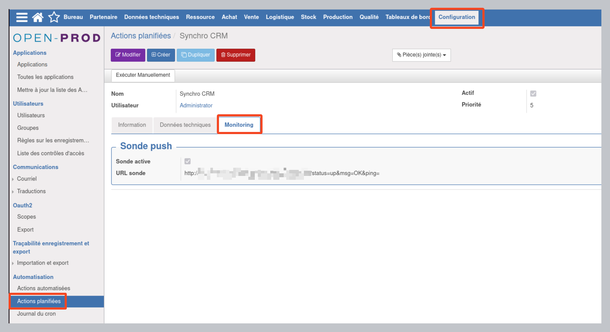

  

# Documentation utilisateur module Cron monitoring

## **Version du document**

| **Version** | **Auteur** | **Date** | **Motif** |
| --- | --- | --- | --- |
| **1** | Jérôme Botreau | 25/08/2024 | Création |

## **Généralités**

Ce module permet de monitorer vos tâches planifiées sur Open-prod, via l'outil open-souce Uptime Kuma.

## **Configuration initiale**

## **Lexique**

Heartbeat interval > Intervalle de signal de vie
Sonde Up > Sonde non déclenchée (Système opérationnel)
Sonde Down > Sonde déclenchée (Anomalie)

### **Droits**

Aucun droit particulier n'est à paramétrer, l'utilisateur doit avoir les droits sur les tâches planifiées (admin).

### **Création d'une sonde (Uptime Kuma)**

Pour ajouter une sonde sur Uptime Kuma :

- Cliquer sur "Ajouter une nouvelle sonde" (1)
- Le type de sonde doit être 'Push'. (2) *C'est Open-prod qui va 'pusher' la sonde.*
- Copier l'URL de la sonde (3), elle devra être collée côté Open-prod.
- Renseigner l'intervalle en secondes (4), il doit correspondre avec la fréquence de déclenchement du cron OP, en tenant compte de son temps d'exécution et avec une petite marge de sécurité. (Exemple : la tâche s'exécute toute les heures et dure 1min, renseignez : 3600 + 60 + 60 (marge sécu) = 3720). 
- Sauvegarder (5)

Paramétrer ensuite les alertes (Mail, SMS, Teams, Telegram, Discord, ...)

### **Configuration de la sonde sur OP**

Dans le menu Configuration > Automatisation > Action planifiées, sélectionner l'action que vous souhaitez monitorer, puis aller sur l'onglet 'Monitoring'.
Cocher le champ 'Sonde activée', puis renseignez (coller) l'URL push de la sonde précédemment créée.

### **Principe de fonctionnement**

A chaque fois que OP terminera l'exécution de la tâche planifiée, si celle-ci s'est terminée sans erreur, OP fera un appel sur l'URL de la sonde, et Uptime Kuma la considera son comme 'Up'.
Si Uptime Kuma n'a pas eu de signal de vie dans l'intervalle défini, la sonde sera 'Down'.
Uptime Kuma alertera donc en fonction de ce qui est configuré sur la sonde.

### **Monitoring via Uptime Kuma**

Exemple de status page : 
